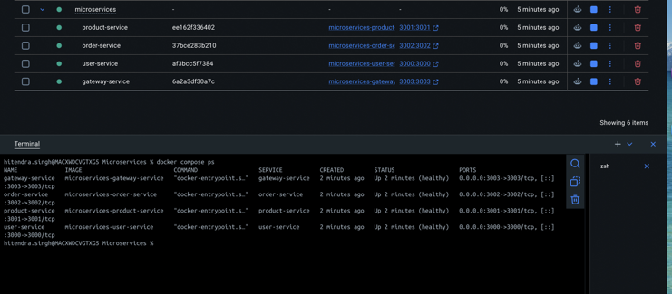
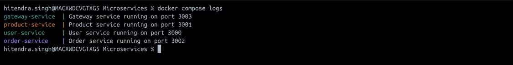

# Microservices Docker Assignment

## Overview

This submission containerizes the provided Node.js microservices and orchestrates them with Docker Compose.

The application contains four services:

| Service | Container Port | Host Port |
|---|---:|---:|
| User Service | 3000 | 3000 |
| Product Service | 3001 | 3001 |
| Order Service | 3002 | 3002 |
| Gateway Service | 3003 | 3003 |

All services run on the shared `microservices-network` Docker bridge network. The Gateway communicates with the other services using Docker Compose service names (`user-service`, `product-service`, and `order-service`) instead of `localhost`.

## Prerequisites

- Docker Desktop or Docker Engine with Docker Compose v2
- Internet access for the first image/dependency build

Verify the installation:

```bash
docker --version
docker compose version
```

## Project Structure

```text
Microservices/
├── user-service/
│   ├── app.js
│   ├── package.json
│   └── Dockerfile
├── product-service/
│   ├── app.js
│   ├── package.json
│   └── Dockerfile
├── order-service/
│   ├── app.js
│   ├── package.json
│   └── Dockerfile
├── gateway-service/
│   ├── app.js
│   ├── package.json
│   └── Dockerfile
├── docker-compose.yml
└── README.md
```

## Build and Start

From the `Microservices` directory:

```bash
docker compose build
docker compose up -d
```

Check the running containers:

```bash
docker compose ps
```

View logs when needed:

```bash
docker compose logs
```

Follow logs for one service:

```bash
docker compose logs -f gateway-service
```

## Health Checks

Each service exposes a `/health` endpoint:

```bash
curl http://localhost:3000/health
curl http://localhost:3001/health
curl http://localhost:3002/health
curl http://localhost:3003/health
```

Expected responses indicate that the corresponding service is healthy.

## Test Each Service

### User Service

```bash
curl http://localhost:3000/users
```

Browser:
`http://localhost:3000/users`

### Product Service

```bash
curl http://localhost:3001/products
```

Browser:
`http://localhost:3001/products`

### Order Service

List orders:

```bash
curl http://localhost:3002/orders
```

Create an order:

```bash
curl -X POST http://localhost:3002/orders \
  -H "Content-Type: application/json" \
  -d '{"userId":1,"productId":2}'
```

List orders again:

```bash
curl http://localhost:3002/orders
```

### Gateway Service

The Gateway exposes the downstream services through `/api` routes:

```bash
curl http://localhost:3003/api/users
curl http://localhost:3003/api/products
curl http://localhost:3003/api/orders
```

Create an order through the Gateway:

```bash
curl -X POST http://localhost:3003/api/orders \
  -H "Content-Type: application/json" \
  -d '{"userId":1,"productId":2}'
```

## Docker Networking

The Compose file creates a shared network named `microservices-network`.

Inside the Docker network:

```text
Gateway Service
   |
   +--> http://user-service:3000/users
   +--> http://product-service:3001/products
   +--> http://order-service:3002/orders
```

`localhost` refers to the current container, so the Gateway must use service names to communicate with the other containers.

## Stop the Application

```bash
docker compose down
```

To remove containers and rebuild from scratch:

```bash
docker compose down --remove-orphans
docker compose build --no-cache
docker compose up -d
```

## Troubleshooting

### Port already in use

If a port is already occupied, check it with:

```bash
docker ps
```

Stop the conflicting application/container or change the host-side port mapping in `docker-compose.yml`.

### Gateway returns a 500 error

Check all downstream service containers:

```bash
docker compose ps
docker compose logs user-service product-service order-service gateway-service
```

Make sure the downstream services are healthy and that all four services are attached to the shared network.

### Container build fails while installing packages

Retry the build with:

```bash
docker compose build --no-cache
```

Confirm Docker has internet access and that the Node.js base image can be pulled.

### Clean restart

```bash
docker compose down --remove-orphans

docker compose up -d --build
```

## Screenshots for Submission

The assignment requires screenshots showing the services running in Docker. After running the application locally, capture at least:

1. `docker compose ps` showing all four services running/healthy.
2. `docker compose logs` showing successful service startup.
3. Browser or terminal output for the Gateway endpoint, for example `http://localhost:3003/api/users`.
4. Optionally, direct service responses from ports 3000, 3001, and 3002.

Insert the screenshots below before submitting the assignment.

### Screenshot 1 - Docker Compose Services




### Screenshot 2 - Service Startup Logs



### Screenshot 3 - Gateway API Response


## Submission Checklist

- [x] Dockerfile for User Service
- [x] Dockerfile for Product Service
- [x] Dockerfile for Order Service
- [x] Dockerfile for Gateway Service
- [x] `docker-compose.yml`
- [x] Shared Docker network configuration
- [x] Correct port mappings
- [x] Service startup commands
- [x] Setup and testing instructions
- [x] Troubleshooting guidance
- [x] Local Docker execution screenshots
